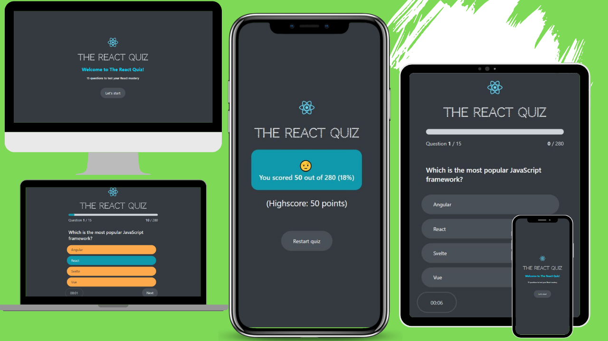

# 🚀 React Quiz App 

> **WAT4 — Web Application Testing project (fork).** This fork adds a full test
> suite (33 tests across the test pyramid: unit, integration, E2E and load) plus a
> CI/CD pipeline and Docker-isolated end-to-end testing.
> **See [`REPORT.md`](./REPORT.md) for the full testing documentation.**
> Quick run instructions are in [REPORT.md §4](./REPORT.md#4-how-to-run-everything-no-local-node-needed--docker-only).

The "React Quiz App" is a dynamic and engaging web application built with React.js. This project offers a variety of features, including a complete responsive design for seamless use on different devices, a clean and intuitive user interface, and a timed quiz with a progress bar to track your progress. 

As you answer questions, the app instantly updates your score and provides a comprehensive scorecard once the quiz is completed. The quiz also includes an automatic submission feature when the timer runs out.

# Demo

 [WEBSITE-Demo](https://vinayak9669.github.io/React-QuizApp/)
 
 [Check out the LinkedIn Post with Video Demo](https://www.linkedin.com/posts/vinay1998_reactjs-webdevelopment-frontenddevelopment-activity-7125437291241644032-3ko7?utm_source=share&utm_medium=member_desktop)

## 🛠️Technology Used 

- [React.js](https://reactjs.org/)

## 📋Project Features 

- 🌐 Complete Responsive Website: This quiz app is designed to work seamlessly on various devices and screen sizes.
- 🎨 Clean and Simple User Interface: A user-friendly design for an enjoyable quiz experience.
- ⏲️ Timer for Quiz: Each quiz question is timed, adding an element of challenge and excitement.
- 📊 Progress Bar: Keep track of your quiz progress in real-time.
- 📈 Score Update: Instant feedback on your score after answering each question.
- 📜 Score Card: Get a comprehensive scorecard with your quiz results.
- ⏱️ Auto-Submission: The quiz automatically submits when the time is up.

## 📚Learning Points 

- 📡 Creating a Fake API: Learn how to create and deploy a mock API and integrate it into project.
- ⚙️ State Management: Explore state management techniques using the `useReducer` hook to efficiently handle application state.
- 🔄 Fetching Data with `useEffect()`: Utilize the `useEffect` hook for fetching API data and managing timers.

## How to Install and Run

1. Clone the repository:

    ```bash
   gh repo clone VINAYAK9669/React-QuizApp
    ```

2. Install dependencies:

    ```bash
    cd React-QuizApp
    npm install
    ```

3. Start the development server:

    ```bash
    npm start
    ```

## 📱Responsiveness 


