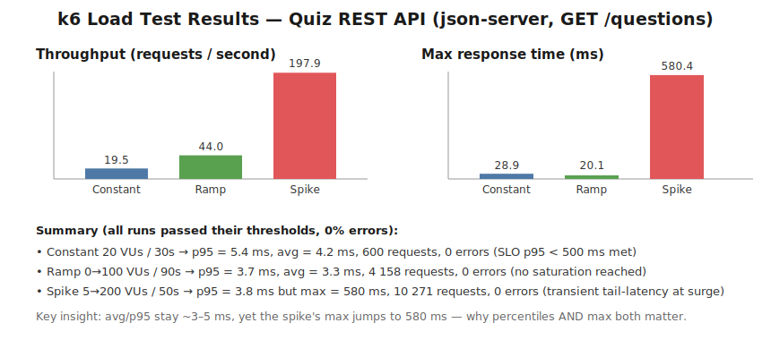

# WAT4 – Web Application Testing — Project Report

**Web application under test:** React Quiz App
**Original repository (forked):** <https://github.com/VINAYAK9669/React-QuizApp>

**Team & contributions (test ownership):**

| Member | Area of responsibility |
|---|---|
| **Erti Prenci** | Scoring & answer logic |
| **Arens Danja** | Quiz flow & navigation |
| **Arlind Frakulla** | Timer, status transitions & resilience |

Each member authored their own slice of the test pyramid (5 unit + 3 integration +
2 system/E2E + 1 load test = 11 tests per person, **33 tests in total**). Every test
file carries an author header so ownership is unambiguous.

> *AI tools used during the project are declared separately by the team.*

---

## 1. The Web Application

The **React Quiz App** is a single-page application built with **Create React App
(React 18)**. It presents a multiple-choice quiz about React:

1. On load it fetches a list of questions from a REST endpoint.
2. The user starts the quiz, answers questions, earns points for correct answers,
   and is timed (5 seconds per question).
3. When the questions run out (or the timer hits zero) a finish screen shows the
   score and the high score; the quiz can be restarted.

### 1.1 Architecture

```
Frontend (React, CRA)                         Backend (REST)
┌────────────────────────────────────┐        ┌──────────────────────┐
│ App  (useReducer state machine)     │        │ json-server          │
│  ├─ logic/quizReducer.js  (pure)    │  HTTP  │  GET /questions      │
│  ├─ components/ (Start, Question,   │ ─────► │  (data/questions.json)│
│  │   Options, Progress, Timer,      │        └──────────────────────┘
│  │   NextButton, FinishScreen, …)   │
│  └─ config.js (configurable API URL)│
└────────────────────────────────────┘
```

The application state is driven by a single **`useReducer`** state machine with the
statuses `loading → ready → active → finished` (plus `error`).

### 1.2 Changes we made on top of the fork

The original app had **no tests** and a couple of things that made it hard to test.
Applying the *Principles for Testable Design* from the lecture, we made small,
behavior-preserving changes:

* **Extracted the reducer** (`reducer`, `initialState`, `maxPossiblePoints`) from
  `App.js` into `src/logic/quizReducer.js`. This follows the **Single Responsibility
  Principle**: the pure state logic is now separated from the React component and can
  be unit-tested in complete isolation (no DOM, no network).
* **Made the data source configurable** via `src/config.js` /
  `REACT_APP_API_URL` (**Dependency Inversion**): the component depends on a
  configurable URL, not a hard-coded one. This lets the same code run against the
  original public API, a local **json-server**, or the Docker-isolated E2E backend.
* **Restored the json-server backend.** `package.json` already declared a
  `json-server` dependency and a `server` script, but the data file was missing. We
  added `data/questions.json`, giving us a real **REST API to load-test**.
* **Added a few `data-testid` attributes** to key UI elements for stable E2E
  selectors (mirroring the `getByTestId` approach from the lecture sample app).

---

## 2. Test Setup

### 2.1 The Test Pyramid

We implemented a healthy *Practical Test Pyramid*: many fast unit tests at the
bottom, fewer integration tests, very few slow end-to-end tests, plus non-functional
load tests.

```
        ▲ slow / expensive
        │            ┌───────────────┐
        │            │  6  E2E (Pl.) │      Playwright (Docker-isolated)
        │        ┌───┴───────────────┴───┐
        │        │   9  Integration      │  Jest + React Testing Library
        │    ┌───┴───────────────────────┴───┐
        │    │       15  Unit                 │ Jest (pure reducer)
        │    └────────────────────────────────┘
        ▼ fast / cheap        +  3 Load tests (k6, non-functional)
```

| Layer | Framework | Count | Per person | Where |
|---|---|---:|---|---|
| **Unit** | Jest | 15 | 5 | `src/__tests__/unit/` |
| **Integration** | Jest + React Testing Library | 9 | 3 | `src/__tests__/integration/` |
| **System / E2E** | Playwright | 6 | 2 | `e2e/tests/` |
| **Load** | k6 | 3 | 1 | `load-tests/` |
| **Total** | | **33** | **11** | |

### 2.2 Frameworks & why

* **Jest + React Testing Library** — Create React App already ships with Jest and
  RTL is the standard way to test React components. It covers both the **solitary
  unit tests** (the pure reducer) and the **sociable integration tests** (rendering
  components into a jsdom DOM and asserting on `dispatch`). `dispatch` is replaced by
  a **Jest mock** (a test double) so components are tested without booting the app.
* **Playwright** — modern, fast browser automation for the **black-box system tests**;
  we use the **Page Object Model** (`e2e/poms/quiz-page.js`), request interception,
  traces, screenshots and video on failure.
* **k6** — scriptable, CI-friendly load-testing tool (recommended in the Load Testing
  lecture). Tests are plain JavaScript with built-in thresholds.

### 2.3 Test structure & conventions

* Tests follow the **AAA pattern** (Arrange / Act / Assert).
* Unit tests target the **public interface** of the reducer (one behavior per test).
* A shared fixture (`src/test-support/questions.js`) provides deterministic data.
* Each test file names its **author** in the header.

### 2.4 Test execution

The development machine has **only Docker** installed (no local Node.js) — so, exactly
like the lecture's `node-container.sh` approach, **every command runs inside a
container**. No global tool installation is required.

| Layer | Command |
|---|---|
| Unit + Integration | `docker run --rm -v "$PWD:/app" -w /app -e CI=true node:20-bullseye-slim npx react-scripts test src/__tests__ --watchAll=false` |
| E2E | `scripts/run-e2e.ps1` (or `scripts/run-e2e.sh`) → `docker compose -f docker-compose.e2e.yml up --build --exit-code-from playwright` |
| Load | `docker run --rm --network <net> -v "$PWD/load-tests:/scripts" -e TARGET=<url> grafana/k6 run /scripts/<file>.js` |

**Latest local results:** 15 + 9 = **24 Jest tests pass**, **6 Playwright tests pass**
(16.5 s), and all **3 k6 load tests pass their thresholds** (see §3).

### 2.5 Test isolation

Isolation is applied at every layer:

* **Unit** — the reducer is a *pure function*; tests share no state and the data
  fixture is read-only.
* **Integration** — RTL mounts each component into a *fresh jsdom* per test; the
  `dispatch` collaborator is a fresh mock; fake timers are reset (`jest.useRealTimers`).
* **E2E** — the **whole system runs in throwaway, networked Docker containers**
  (`docker-compose.e2e.yml`): a `backend` (json-server), a production `frontend`
  build, and the `playwright` runner. They communicate over a private compose network
  (the browser reaches the backend by service name), so the run is fully isolated from
  the developer's machine **and** from any other run. `down -v` tears everything down.
* **Load** — json-server runs in its own container on a dedicated Docker network; k6
  runs in another container and targets it by name.

### 2.6 CI/CD pipeline

`.github/workflows/ci.yml` runs the whole pyramid on every push / PR to `main`,
mirroring the lecture sample's job split:

1. **`unit-integration`** — `npm ci` + Jest.
2. **`e2e`** — builds and runs the isolated Docker stack, uploads the Playwright HTML
   report as an artifact.
3. **`load`** — starts json-server, runs the k6 constant-load test; the **k6
   thresholds act as a quality gate** (threshold breach fails the build —
   *"threshold-based pipeline failures"* from the lecture).

---

## 3. Load Testing

### 3.1 Goal & SLO

> **SLO:** the questions REST API should answer with **p95 < 500 ms** and an
> **error rate < 1 %** under expected load.

Load testing is **non-functional** ("how well does it work?"). We model three load
profiles from the lecture (constant, ramp-up/down, spike), all hitting the read hot
path `GET /questions` that the frontend depends on at start-up. All scripts use a
**think time** between requests so the generated load is realistic.

| # | Profile | Author | Workload model |
|---|---|---|---|
| 01 | **Constant load** (SLO validation) | Erti Prenci | 20 constant VUs, 30 s, ~1 s think time |
| 02 | **Ramp-up / ramp-down** (find saturation) | Arens Danja | 0 → 20 → 50 → 100 → 0 VUs over 90 s |
| 03 | **Spike** (sudden surge) | Arlind Frakulla | 5 → **200** VUs in 5 s, hold 20 s, recover |

### 3.2 Results



Interactive k6 dashboards (time-series charts) are committed in
`load-tests/results/*.report.html`; the machine-readable summaries are in
`load-tests/results/*.summary.json` and the raw console output in `*.txt`.

| Metric | 01 Constant | 02 Ramp | 03 Spike |
|---|---:|---:|---:|
| Requests | 600 | 4 158 | 10 271 |
| Throughput (req/s) | 19.5 | 44.0 | 197.9 |
| Avg latency | 4.2 ms | 3.3 ms | 3.3 ms |
| **p95 latency** | **5.4 ms** | **3.7 ms** | **3.8 ms** |
| **Max latency** | 28.9 ms | 20.1 ms | **580.4 ms** |
| Error rate | 0 % | 0 % | 0 % |
| Thresholds | ✅ pass | ✅ pass | ✅ pass |

### 3.3 Analysis

* **The SLO is met comfortably.** Under expected load (constant 20 VUs) the API
  answers in **p95 ≈ 5 ms**, two orders of magnitude under the 500 ms budget, with
  zero errors.
* **Throughput scales with load** (19.5 → 44 → 198 req/s) while average and p95
  latency stay flat at ~3–5 ms. So at the levels we tested **no saturation / knee
  point was reached** — the single-threaded Node json-server serves the small (~4 KB)
  static dataset very efficiently.
* **Why percentiles *and* max matter (lecture slide 8).** The spike test is the most
  interesting: avg and p95 stay at ~3.8 ms, **yet the maximum jumps to 580 ms** at the
  instant 200 virtual users connect almost simultaneously. A single connection-storm
  outlier is invisible in the average/p95 but very visible in the max — exactly why we
  report multiple percentiles and the max, not just the mean.
* **No backpressure / collapse**: error rate stayed at 0 % throughout and the service
  recovered immediately after the spike dropped.

### 3.4 Bottleneck & optimization (where it *would* break)

The bottleneck of this stack is the **single-threaded, file-watching json-server** and
the fact that the dataset is re-served on every request without caching. To actually
reach the saturation point one would **remove think time and push to thousands of
VUs** (a dedicated *stress test*, out of scope for the one assigned load test each).
Following the lecture's optimization techniques, scaling this API would mean:
**caching** the (static) question list, running **multiple instances behind a load
balancer** (horizontal scaling), and serving the static JSON from a **CDN** instead of
a Node process.

---

## 4. How to run everything (no local Node needed — Docker only)

```bash
# 1) install dependencies once (into ./node_modules) via a container
docker run --rm -v "$PWD:/app" -w /app node:20-bullseye-slim npm ci

# 2) unit + integration tests
docker run --rm -v "$PWD:/app" -w /app -e CI=true \
  node:20-bullseye-slim npx react-scripts test src/__tests__ --watchAll=false

# 3) end-to-end tests (isolated Docker stack)
pwsh scripts/run-e2e.ps1            # or:  sh scripts/run-e2e.sh

# 4) load tests (k6) — start the backend then run a script, e.g. the spike test
docker network create wat4-load
docker run -d --name wat4-backend --network wat4-load -v "$PWD:/app" -w /app \
  node:20-bullseye-slim npx json-server --watch data/questions.json --host 0.0.0.0 --port 9000
docker run --rm --network wat4-load -v "$PWD/load-tests:/scripts" \
  -e TARGET=http://wat4-backend:9000 grafana/k6 run /scripts/03-spike.js
```

## 5. Repository layout

```
React-QuizApp/
├─ src/
│  ├─ components/                 # React UI (+ data-testid attributes)
│  ├─ logic/quizReducer.js        # pure state machine (unit-test SUT)
│  ├─ config.js                   # configurable API URL
│  ├─ test-support/questions.js   # shared test fixture
│  └─ __tests__/
│     ├─ unit/                    # 15 unit tests  (scoring / flow / timer-status)
│     └─ integration/            #  9 integration tests
├─ e2e/                           # Playwright: config, POMs, 6 specs
├─ load-tests/                    # 3 k6 scripts + results/ (html, json, txt)
├─ data/questions.json            # json-server backend data
├─ docker-compose.e2e.yml         # isolated E2E stack
├─ e2e.Dockerfile                 # production frontend image for E2E
├─ scripts/run-e2e.{ps1,sh}       # E2E helper
├─ .github/workflows/ci.yml       # CI/CD pipeline
└─ REPORT.md                      # this file
```
